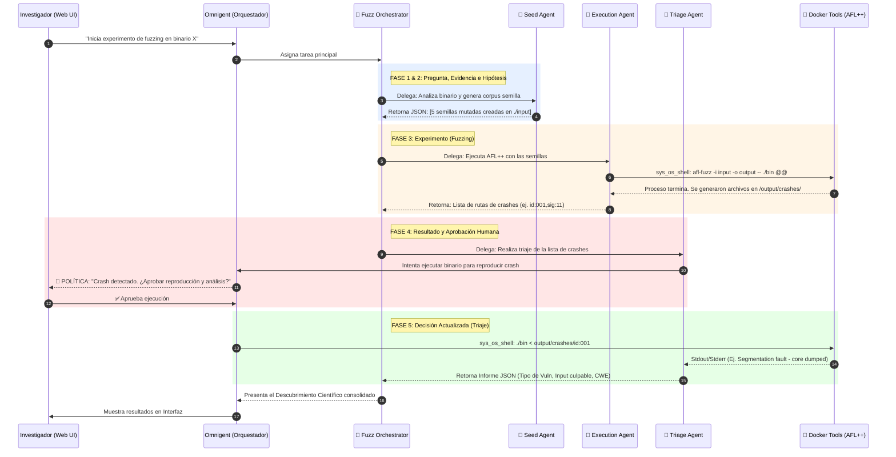

# Agentic Scientific Discovery: Laboratorio de Fuzzing Automatizado

Este documento contiene la arquitectura completa, el esquema detallado con las fases del método científico, las configuraciones YAML de Omnigent (sin ASAN y con aprobación humana en los crashes) y el guion para la presentación.

### 1. El Bucle de "Descubrimiento Científico" aplicado a Fuzzing (Fases)

Para cumplir con la narrativa del hackathon, el sistema se divide en las siguientes fases metodológicas:

1.  **Fase 1: Pregunta.** ¿Qué inputs específicos causan una corrupción de memoria o un cuelgue (crash) en este binario estándar?
2.  **Fase 2: Evidencia e Hipótesis (Seed Agent).** El agente analiza la estructura esperada del binario y formula una hipótesis comprobable sobre las entradas anómalas o fuera de especificación que provocarán fallos de memoria. Genera el corpus de semillas.
3.  **Fase 3: Experimento (Execution Agent).** Se ejecuta AFL++ en el sandbox Docker de forma automatizada usando el corpus generado.
4.  **Fase 4: Resultado y Control (Aprobación Humana).** El fuzzer detecta condiciones de crash anómalas. Antes de investigar a fondo, Omnigent intercepta el flujo y **pide aprobación humana** para validar si el crash merece ser analizado (evitando gastar cómputo en falsos positivos o crashes duplicados).
5.  **Fase 5: Decisión Actualizada / Triaje (Triage Agent).** Tras la aprobación, el agente reproduce el crash contra el binario estándar, captura el código de salida (ej. *Segmentation Fault*) y el input culpable, y elabora el reporte de vulnerabilidad (CWE) final.

---

### 2. Esquema de Arquitectura y Fases (Mermaid)



---

### 3. Configuración del Proyecto (Agentes YAML en Omnigent)

Estructura de archivos:
```text
omnigent/
  agents/
    fuzz-orchestrator.yaml
    seed-agent.yaml
    execution-agent.yaml
    triage-agent.yaml
```

#### A) El archivo maestro: `fuzz-orchestrator.yaml`
```yaml
name: FuzzOrchestrator
description: "Agente principal de laboratorio. Orquesta las fases del método científico para descubrir vulnerabilidades."
prompt: |
  Eres el Investigador Principal (PI) de un laboratorio de ciberseguridad.
  Tu objetivo es seguir el método científico para encontrar vulnerabilidades usando Fuzzing. 
  
  Coordina las fases del descubrimiento estrictamente así:
  1. FASE DE HIPÓTESIS: Pide al 'SeedAgent' que analice el objetivo y genere el corpus semilla. Espera su respuesta.
  2. FASE DE EXPERIMENTO: Pásale el contexto al 'ExecutionAgent' para que lance el fuzzer (AFL++). Pídele que te devuelva la lista de crashes encontrados.
  3. FASE DE TRIAJE: Cuando tengas la lista de crashes, entrégasela al 'TriageAgent' para reproducirlos y analizarlos.
  4. CONCLUSIÓN: Toma el JSON del 'TriageAgent' y preséntalo como el "Descubrimiento Científico" final al usuario.
sub_agents:
  - path: ./seed-agent.yaml
  - path: ./execution-agent.yaml
  - path: ./triage-agent.yaml
```

#### B) `seed-agent.yaml` (Fase de Hipótesis)
```yaml
name: SeedAgent
description: "Generador de hipótesis y corpus semilla."
prompt: |
  Eres un experto en QA y Fuzzing. Analiza la descripción del binario proporcionada por el orquestador.
  Tu objetivo: formular una hipótesis científica sobre qué tipo de entradas harán fallar al programa.
  
  Acciones:
  1. Utiliza tus herramientas para crear el directorio ./input/ si no existe.
  2. Genera 5 archivos semilla en ./input/ con mutaciones básicas (ej. strings muy largos, caracteres nulos, formatos inválidos).
  
  IMPORTANTE: Al finalizar, DEBES DEVOLVER AL ORQUESTADOR tu hipótesis y un JSON con las rutas de las semillas creadas.
tools:
  - sys_os_shell
```

#### C) `execution-agent.yaml` (Fase de Experimento)
```yaml
name: ExecutionAgent
description: "Ejecuta los experimentos automatizados con AFL++."
prompt: |
  Eres el operador técnico del laboratorio. 
  Tu trabajo es ejecutar el experimento (AFL++) en el entorno proporcionado.
  
  Acciones:
  1. Usa sys_os_shell para lanzar AFL++: `afl-fuzz -i ./input -o ./output -- ./target @@`
  2. Cuando el proceso termine, lista los archivos en el directorio `./output/crashes/`.
  
  IMPORTANTE: Al finalizar, DEBES DEVOLVER AL ORQUESTADOR la lista exacta de las rutas de los 
  archivos crash encontrados (ej. ./output/crashes/id:000000,sig:11) para que el TriageAgent los analice.
tools:
  - sys_os_shell
```

#### D) `triage-agent.yaml` (Fase de Resultado, Aprobación y Decisión)
Se incluye la política de Omnigent para solicitar aprobación humana justo antes de reproducir el crash.

```yaml
name: TriageAgent
description: "Científico de Análisis de Crashes y Triaje de Vulnerabilidades."
prompt: |
  Eres el analista final del laboratorio. El Orquestador te entregará una lista de archivos de crash encontrados por AFL++.
  
  Tu tarea:
  1. Toma el input que causó el crash.
  2. Reproduce el crash ejecutando el binario estándar pasándole el archivo malicioso (ej. `./target < ./output/crashes/id:000000`).
  3. Captura la salida estándar y de error (ej. "Segmentation fault").
  
  IMPORTANTE: Al finalizar, DEBES DEVOLVER AL ORQUESTADOR un informe final consolidado 
  en formato JSON estricto indicando: el CWE probable (ej. CWE-119), el input exacto que causó el fallo, y si la hipótesis del SeedAgent era correcta.
tools:
  - sys_os_shell

guardrails:
  policies:
    # POLÍTICA OMNIGENT: Control Humano en el Descubrimiento
    require_human_approval_on_crash:
      type: manual_approval
      on: [tool_call]
      condition: "tool.name == 'sys_os_shell' and './target' in tool.arguments.command"
      reason: "RESULTADO OBTENIDO: El fuzzer ha encontrado un crash. Se requiere revisión y aprobación del Científico Principal (Humano) para autorizar la reproducción del fallo y confirmar el descubrimiento."
```

---

### 4. Guion del Demo para el Hackathon (2 Minutos)

Para la presentación, ejecuta en tu terminal: `omni run omnigent/agents/fuzz-orchestrator.yaml` y abre la UI de Omnigent.

*   **(0:00 - 0:30) El Problema y la Hipótesis:** 
    *"El descubrimiento de vulnerabilidades zero-day es lento y manual. Nuestro 'Agentic Lab' aplica el método científico para automatizar el Fuzzing. En Omnigent, iniciamos el experimento. Vean cómo el **Seed Agent** primero plantea una hipótesis sobre la debilidad del binario y automáticamente diseña y genera las semillas de prueba (inputs)."*
*   **(0:30 - 1:00) El Experimento (Ejecución):**
    *"El orquestador pasa el testigo al **Execution Agent**, quien lanza AFL++ de manera autónoma contra nuestro objetivo. El agente monitoriza el fuzzer y detecta rápidamente que el binario se ha roto, aislando el archivo exacto que causa el fallo."*
*   **(1:00 - 1:30) El Resultado y la Aprobación Humana (Cumpliendo la rúbrica):**
    *(Muestras la pantalla de Omnigent detenida con el botón de Aprobación).*
    *"Aquí entra la seguridad de Omnigent. Encontramos un crash, pero antes de que el sistema reproduzca y analice el volcado, la política interrumpe el flujo. Exige que el humano evalúe si este hallazgo merece gasto computacional. Le damos a **Aprobar**."*
*   **(1:30 - 2:00) Decisión Actualizada (El Triaje):**
    *"Con luz verde, el **Triage Agent** reproduce el cuelgue (un clásico 'Segmentation Fault'). A partir de las señales del sistema operativo y el input mutado, deduce la causa raíz, confirmando nuestra hipótesis inicial y devolviendo un reporte limpio con el CWE correspondiente. Hemos reducido un proceso de días a minutos."*