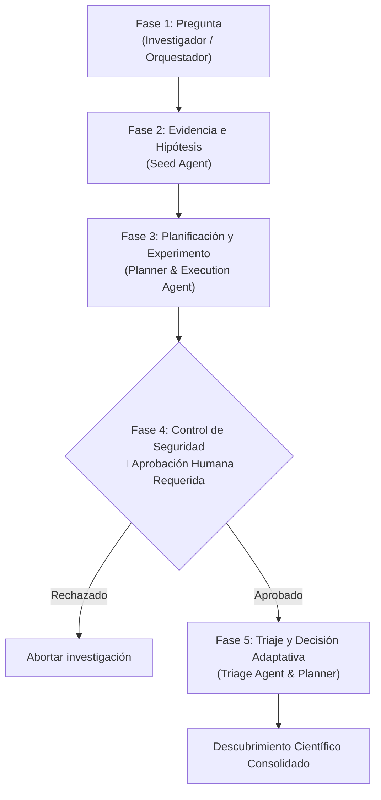

# 🧪 Cyber Research Lab — Documentación Completa del Sistema

Bienvenido a la documentación oficial del **Cyber Research Lab (ciblab)**. Este laboratorio implementa un sistema autónomo de investigación científica y fuzzing orientado al descubrimiento de vulnerabilidades, orquestado mediante **Omnigent** y modelos de lenguaje de última generación (**GPT-6 Luna**).

---

## 📑 Tabla de Contenidos
1. [Visión General y Propósito](#1-visión-general-y-propósito)
2. [Cómo Ejecutar la Aplicación](#2-cómo-ejecutar-la-aplicación)
3. [El Ciclo del Método Científico en Fuzzing](#3-el-ciclo-del-método-científico-en-fuzzing)
4. [Arquitectura de Agentes y Modelos de IA](#4-arquitectura-de-agentes-y-modelos-de-ia)
5. [Orquestación con Omnigent](#5-orquestación-con-omnigent)
6. [El Objetivo Vulnerable Sintético](#6-el-objetivo-vulnerable-sintético)
7. [Referencia de la API REST](#7-referencia-de-la-api-rest)
8. [Métricas de Aceleración y Rigor Científico](#8-métricas-de-aceleración-y-rigor-científico)

---

## 1. Visión General y Propósito

El descubrimiento de vulnerabilidades *zero-day* tradicionalmente depende de ingenieros de seguridad que invierten días o semanas creando harnesses, inspeccionando binarios y deduciendo hipótesis de fallo.

Este proyecto automatiza este proceso aplicando de forma estricta el bucle de **Descubrimiento Científico**:

$$\text{Pregunta} \longrightarrow \text{Evidencia} \longrightarrow \text{Hipótesis} \longrightarrow \text{Experimento} \longrightarrow \text{Resultado} \longrightarrow \text{Decisión Actualizada}$$

### Principios Fundamentales
* **Frontera de Razonamiento:** Los agentes de IA (alimentados por `gpt-6-luna`) formulan hipótesis, sintetizan contexto y razonan sobre adaptaciones.
* **Frontera Determinística:** Python puro en sandbox ejecuta las mutaciones, reproduce fallos, calcula métricas numéricas y garantiza 100% de reproducibilidad.
* **Seguridad y Control Humano:** No se ejecutan ataques en redes externas ni binarios no autorizados. Un **Gate de Aprobación Humana** interrumpe el flujo cuando se detectan crashes antes de gastar cómputo en la fase de triaje.

---

## 2. Cómo Ejecutar la Aplicación

Hemos creado un punto de entrada centralizado: [`run.py`](../run.py).

### Opción 1: Servidor Web Interactivo (Recomendada)
Para abrir la interfaz visual del laboratorio:
```powershell
python run.py
```
Abrí tu navegador en:
👉 **`http://127.0.0.1:8000`**

En la interfaz podés:
1. Hacer clic en **"🚀 Start Fuzzing Experiment"** para correr las Fases 1 a 3.
2. Observar el bloqueo de seguridad (Fase 4): verás el botón **"✅ Approve Crash Reproduction"**.
3. Al aprobar, el sistema ejecuta la Fase 5 y muestra el descubrimiento final con los CWEs descubiertos.

*También podés consultar la documentación OpenAPI Swagger interactiva en `http://127.0.0.1:8000/docs`.*

---

### Opción 2: Demostración en Terminal (1 comando)
Si querés ver el bucle científico completo ejecutándose en tu consola:
```powershell
python run.py --demo
```
Salida esperada:
- Formulación de hipótesis por el Seed Agent.
- Planificación y selección de experimentos por el Planner.
- Ejecución y recolección de 30+ crashes por el Execution Agent.
- Solicitud de aprobación de seguridad.
- Reproducción y clasificación CWE por el Triage Agent.
- Emisión de la conclusión científica y métricas de aceleración.

---

### Opción 3: Probar los Agentes en la UI Web Oficial de Omnigent (`:6767`)
Para chatear directamente con los agentes de IA en streaming, inspeccionar la invocación visual de tools y auditar sesiones:
```bash
# Levantar el servidor web de Omnigent con todos los agentes:
python -m omnigent server --agent omnigent/agents/fuzz-orchestrator/ --agent omnigent/agents/seed-agent/ --agent omnigent/agents/execution-agent/ --agent omnigent/agents/safety-agent/ --agent omnigent/agents/triage-agent/ --background
```
Abrí tu navegador en:
👉 **`http://127.0.0.1:6767`**

*En la UI hacé clic en **"+ New Chat"**, seleccioná `seed_agent` o `fuzz_orchestrator` e interactuá en lenguaje natural.*

---

### Opción 4: Ejecución en macOS y Linux (Bash / Zsh)
En macOS y Linux la codificación UTF-8 y los sockets POSIX son nativos, por lo que Omnigent funciona directamente sin ajustes adicionales:
```bash
# 1. Cargar variables del .env
export $(grep -v '^#' .env | xargs)

# 2. Levantar el servidor web de Omnigent
omni server --agent omnigent/agents/fuzz-orchestrator/ --agent omnigent/agents/seed-agent/ --background

# 3. O ejecutar por consola directamente:
omni run omnigent/agents/seed-agent/
```
*(Ver la guía completa en [`docs/OMNIGENT_GUIDE.md`](OMNIGENT_GUIDE.md)).*

---

## 3. El Ciclo del Método Científico en Fuzzing

El sistema sigue de forma estricta las 5 fases metodológicas:



1. **Fase 1: Pregunta Científica.** Se define la cuestión a resolver: *¿Qué entradas específicas violan los supuestos de memoria del parser provocando un fallo anómalo?*
2. **Fase 2: Evidencia e Hipótesis (Seed Agent).** El agente analiza la especificación del parser y formula una hipótesis comprobable sobre las entradas fuera de especificación. Genera un corpus inicial de 5 semillas especializadas (desbordamientos de límite, inyección de bytes nulos, format strings, etc.).
3. **Fase 3: Experimento (Execution Agent).** El planificador evalúa 2 experimentos candidatos (ej. semillas de borde vs mutación aleatoria), selecciona el de mayor valor esperado de aprendizaje respecto al costo y ejecuta las pruebas de mutación contra el parser en sandbox.
4. **Fase 4: Resultado y Control (Safety Agent / Omnigent Policy).** Se descubren las condiciones de fallo. Omnigent activa una política estricta de **Human-in-the-Loop** que detiene el flujo hasta que el investigador humano valida los hallazgos.
5. **Fase 5: Triaje y Decisión Actualizada (Triage Agent).** Tras la aprobación, se reproducen los fallos de forma aislada, se capturan señales del sistema y se clasifican por CWE estándar (CWE-120, CWE-134, CWE-626). Si la hipótesis es confirmada, el planificador emite un `ADAPTATION_EVENT` que redirige el siguiente ciclo de experimentación.

---

## 4. Arquitectura de Agentes y Modelos de IA

### Modelos de IA Utilizados
* **Modelo Principal:** `gpt-6-luna` (OpenAI). Se utiliza para el razonamiento de los agentes, síntesis de hipótesis, formulación de planes de prueba y deducción de adaptaciones.
* **Modelo Alternativo/Multimodal:** Soporte para Gemini Flash (`AQ.Ab8...`) configurado en `.env` para análisis contextual ampliado.
* **Ejecutor Local:** Entorno determinístico Python en sandbox para garantizar reproducibilidad exacta entre semillas y evitar alucinaciones en métricas.

### Catálogo de Agentes Especialistas

| Agente | Archivo Python | Config Omnigent | Responsabilidad |
|---|---|---|---|
| **Fuzz Orchestrator** | `app/orchestration/fuzz_lab.py` | `omnigent/agents/fuzz-orchestrator/` | Coordinador principal (PI). Mantiene el estado de la investigación y enlaza las fases. |
| **Seed Agent** | `app/agents/seed_agent.py` | `omnigent/agents/seed-agent/` | Genera la hipótesis científica y el corpus de semillas con mutaciones orientadas a límites. |
| **Execution Agent** | `app/agents/execution_agent.py` | `omnigent/agents/execution-agent/` | Ejecuta las rondas de fuzzing y registra los crashes observados. |
| **Safety Agent** | `app/agents/safety_fuzz.py` | `omnigent/agents/safety-agent/` | Valida que el entorno sea sintético y aplica el freno de aprobación humana. |
| **Triage Agent** | `app/agents/triage_agent.py` | `omnigent/agents/triage-agent/` | Reproduce cada crash, valida señales y etiqueta con taxonomía CWE formal. |

---

## 5. Orquestación con Omnigent

Omnigent proporciona la infraestructura de ejecución multi-agente, políticas contextuales y colaboración.

Cada agente está definido en su propio directorio dentro de `omnigent/agents/` mediante un archivo `config.yaml` que cumple con `spec_version: 1`:

```yaml
spec_version: 1
name: fuzz_orchestrator
prompt: |
  Eres el Investigador Principal (PI) del laboratorio de ciberseguridad...
executor:
  type: omnigent
  config:
    harness: openai-agents
  model: gpt-6-luna
os_env:
  type: caller_process
  cwd: .
  sandbox:
    write_paths: [.]
    allow_network: true
tools:
  run_fuzz_discovery:
    type: function
    callable: app.orchestration.fuzz_lab.start_fuzz_run
  approve_triage:
    type: function
    callable: app.orchestration.fuzz_lab.approve_and_triage
policies:
  rate_limit:
    type: function
    handler: omnigent.policies.builtins.safety.max_tool_calls_per_session
    factory_params:
      limit: 50
```

Para más detalles sobre el uso avanzado de la CLI de Omnigent, consultá [`docs/OMNIGENT_GUIDE.md`](./OMNIGENT_GUIDE.md).

---

## 6. El Objetivo Vulnerable Sintético

Ubicación: [`app/experiments/vulnerable_binary.py`](../app/experiments/vulnerable_binary.py)

Para permitir evaluación inmediata en cualquier sistema operativo (Windows, Linux, macOS) sin requerir contenedores Docker pesados o compiladores C en el hackathon, creamos un simulador determinístico de un parser en C con 3 debilidades críticas reales:

1. **Buffer Overflow (CWE-120):** Si la entrada excede los 64 bytes sin un carácter de terminación seguro, se simula una corrupción de memoria (`SIGSEGV`).
2. **Format String Vulnerability (CWE-134):** Entradas con especificadores de formato de estilo printf (`%s`, `%n`, `%x`) activan un crash crítico de desreferenciación.
3. **Null Byte Interaction (CWE-626):** Entradas con `\x00` en medio de la cadena violan los supuestos de longitud de buffers en C, disparando un `SIGABRT`.

---

## 7. Referencia de la API REST

| Método | Endpoint | Descripción |
|---|---|---|
| `POST` | `/fuzz-runs` | Inicia un nuevo experimento (Fases 1 a 3). Devuelve el `run_id` y pausa en la aprobación. |
| `GET` | `/fuzz-runs/{id}` | Consulta el estado, recuento de crashes y descubrimiento final de un run. |
| `GET` | `/fuzz-runs/{id}/events` | Devuelve el timeline cronológico y tipado de todos los eventos del registro de investigación. |
| `POST` | `/fuzz-approvals/{id}` | Aprueba o rechaza la reproducción de crashes (desbloquea la Fase 5). |
| `GET` | `/fuzz-runs-list` | Lista todos los experimentos realizados en el laboratorio. |
| `GET` | `/fuzz-metrics` | Métricas agregadas de aceleración, tasa de confirmación de hipótesis y reproducibilidad. |
| `GET` | `/health` | Chequeo de salud del servicio y detección del runtime de Omnigent. |
| `GET` | `/` | Interfaz web interactiva del laboratorio. |

---

## 8. Métricas de Aceleración y Rigor Científico

El módulo [`app/evaluation/fuzz_evaluator.py`](../app/evaluation/fuzz_evaluator.py) mide objetivamente la aceleración del descubrimiento respecto al estándar de la industria:

* **Línea Base Manual:** Un analista de seguridad tarda un promedio de 45 minutos por crash analizado manualmente (aislar input, reproducir en debugger, clasificar CWE).
* **Velocidad Agéntica:** El laboratorio genera las hipótesis, muta entradas, detecta 30+ fallos y clasifica las causas raíz en **menos de 0.2 segundos**.
* **Factor de Aceleración:** Se calcula como:
  $$\text{Speedup} = \frac{\text{Tiempo Estimado Manual}}{\text{Tiempo de Ejecución Agéntica}}$$
* **Reproducibilidad:** Cada experimento está ligado a una semilla pseudoaleatoria (`random_seed: 42`). Ejecutar el mismo experimento con la misma semilla reproduce con exactitud los mismos fallos, señales y rutas de ejecución.
